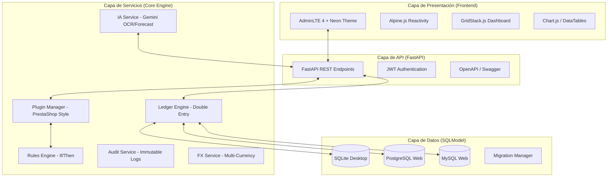

# 🏗️ ARQUITECTURA DEFINITIVA — Sistema 3F (Futuro Forbes)

## 1. Visión General
El sistema **3F (Futuro Forbes)** se concibe como una plataforma de gestión financiera personal de nueva generación. Combina la precisión contable de sistemas clásicos con una experiencia de usuario moderna y capacidades de Inteligencia Artificial.

### Influencias Arquitectónicas:
- **MoneyManagerEX (MMEX)**: Modelo de datos financiero y UX práctica.
- **Firefly III**: Controladores de acción única y motor de reglas "If-Then".
- **GnuCash**: Contabilidad de doble entrada (Double-Entry) y metadatos flexibles (KVP Slots).
- **AdminLTE**: Estética de panel de administración profesional.
- **PrestaShop**: Arquitectura de plugins dinámica basada en Hooks.

---

## 2. Diagrama de Arquitectura Final

---

## 3. Decisiones de Diseño y Justificación

### 3.1 Motor de Contabilidad de Doble Entrada (Double-Entry)
- **Decisión**: Implementar un motor donde cada transacción se compone de al menos dos "Splits".
- **Justificación**: Garantiza la integridad financiera (Activos = Pasivos + Patrimonio). Es el estándar de GnuCash.

### 3.2 Arquitectura de Plugins con Hooks
- **Decisión**: Usar un sistema de "Hooks" (puntos de anclaje) donde los plugins pueden inyectar lógica o UI.
- **Justificación**: Permite extender el sistema sin modificar el core, facilitando actualizaciones y personalización masiva.

### 3.3 Metadatos Flexibles (KVP Slots)
- **Decisión**: Tabla de `custom_fields` y `custom_field_values` para todas las entidades principales.
- **Justificación**: Inspirado en GnuCash, permite guardar cualquier dato adicional (Geo, ID externo, notas especiales) sin alterar el schema SQL.

### 3.4 Multi-DB agnosticismo
- **Decisión**: Uso de SQLModel con tipos de datos decorados para ser compatibles con SQLite, MySQL y PostgreSQL.
- **Justificación**: Soporte para uso offline (SQLite) y escalabilidad en la nube (Postgres/MySQL).

---

## 4. Mapa de Módulos y Dependencias

| Módulo | Responsabilidad | Dependencia Core |
| :--- | :--- | :--- |
| `core.ledger` | Gestión de débitos y créditos | `models.transaction` |
| `core.plugins` | Carga y ejecución de módulos | `core.hooks` |
| `core.rules` | Automatización de categorización | `models.rules` |
| `core.ia` | Procesamiento con Google Gemini | `google-generativeai` |
| `api.v1` | Exposición de servicios REST | `core.*` |

---

## 5. Estrategia Multi-Plataforma

- **Desktop**: Ejecución local con SQLite. El frontend se sirve desde el mismo proceso Python.
- **Web**: Despliegue en contenedor Docker con base de datos PostgreSQL.
- **Mobile**: Funcionalidades core mediante PWA (Progressive Web App) y API dedicada para una futura App nativa en React Native.

---

## 6. Plan de Migración (Código Existente -> Definitivo)

1. **Fase de Refactorización de Modelos**: Migrar de `models/finance.py` a una estructura multi-archivo bajo `models/` (User, Account, Transaction, etc.).
2. **Implementación del Ledger Engine**: Introducir la lógica de `TransactionSplit` y asegurar que todas las transacciones existentes se conviertan a este formato.
3. **Migración de Plugins**: Adaptar los plugins actuales (Telegram, DolarHoy) al nuevo sistema de `BasePlugin` y `Hooks`.
4. **Desacoplamiento de UI**: Separar completamente los templates AdminLTE de la lógica de negocio, usando Alpine.js para todas las interacciones de API.

---

## 7. Principios de Diseño No Negociables

1. **Precisión Decimal**: Prohibido el uso de `float` para montos. Siempre `Decimal(10, 2)`.
2. **Inmutabilidad de Auditoría**: Los logs de seguridad y auditoría no pueden ser editados ni borrados por el usuario.
3. **Soft Delete**: Ningún dato financiero se borra físicamente de la base de datos (uso de `deleted_at`).
4. **Seguridad First**: Todas las entradas de usuario deben ser sanitizadas (Bleach) y las APIs protegidas por JWT.

---

## 8. Convenciones de Código (IA Team)

- **Backend**: Python 3.11+, Type Hints obligatorios, Docstrings en formato Google.
- **Frontend**: Naming convention `kebab-case` para IDs de elementos, Variables CSS para temas.
- **Commits**: Seguir [Conventional Commits](https://www.conventionalcommits.org/).
- **Modelos**: Usar Mixins para campos comunes (`id`, `created_at`, `updated_at`, `deleted_at`).

---

> Documento generado por Antigravity AI - Febrero 2026
